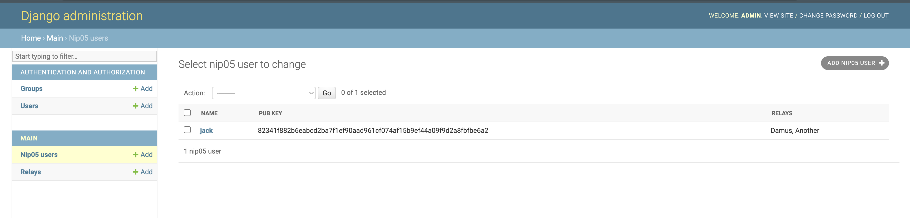

nostr-django
------------

A service for managing [NIP-05](https://github.com/nostr-protocol/nips/blob/master/05.md) users for a given domain. Comes with a django admin app for managing users.

## Setup
```
pip3 install -r requirements.txt


./manage.py migrate

# Create an admin user
./manage.py createsuperuser

# Go to http://localhost:8000/admin
./manage.py runserver

```




```
curl https://bekindorrewind.com/.well-known/nostr.json

# For a specific user
https://bekindorrewind.com/.well-known/nostr.json?name=jack
```


## Todo
- [ ] Create integration with Lighting network and make routes for paying users
- [ ] Make docker build